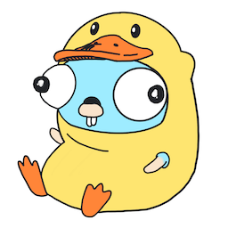

# QuackFS



QuackFS is a FUSE-based filesystem that uses PostgreSQL and S3 as a backend for persistence. Its storage model is based on Differential Storage, meaning that it only stores the differences between write operations, which allows for time-travel, zero-copy sharing and efficient versioning.

## Purpose

QuackFS is specialized for DuckDB database files and their associated Write-Ahead Log (WAL) files. It is not intended as a general-purpose filesystem. Checkout the [architecture diagram](./architecture-diagram.jpg) for more details.

This project was created for learning purposes and to explore the idea of Differential Storage. It was greatly inspired by [this blog post](https://motherduck.com/blog/differential-storage-building-block-for-data-warehouse/) by MotherDuck 🦆. Do check it out to have a better understanding of what I've implemented here.

> [!WARNING]
> This project is not production-ready. It is a proof of concept and should not be used in production environments.

## Getting Started

### Prerequisites

- Docker
- VSCode, Cursor or Github Codespaces 
    - Install [Dev Containers extension](https://marketplace.visualstudio.com/items?itemName=ms-vscode-remote.remote-containers)

It should work with any other IDE that supports Dev Containers, but I've only tested it with the above.

### Setup the project

After opening the project in your IDE and having installed the Dev Containers extension, you can open the command palette (`Ctrl+Shift+P` or `Cmd+Shift+P`) and search and select `Dev Containers: Reopen in Container`. This will start the container, which can take a couple minutes to build.

## Usage

All the commands listed below should be run inside the container that was created in the previous step. If you're using VSCode, you can open the integrated terminal and it will be running inside the container already. Alternatively, you can run `docker exec -it -w /workspaces/quackfs quackfs zsh` on your favorite terminal and follow from there.

To run the QuackFS process (storage backend), you can use the following command:

```bash
$ make run
```

In another terminal you can run DuckDB CLI to open/create a database in the FUSE mountpoint (default is `/tmp/fuse`):

```bash
$ duckdb /tmp/fuse/db.duckdb
```

Alternatively, you can run our "load" test script (make sure `make run` is running in another terminal), because this script will run against the Differential Storage implementation:

```bash
$ make load
```

To run all the tests, run following command:

```bash
$ make test
```

For other commands, check the Makefile.

### Time Travel

To time travel, you can use the `log` command to see the version history of a file and select a version to time travel to by pressing `Enter` on a version row.

```bash
$ LOG_LEVEL=error go run cmd/op/main.go log -file db.duckdb
```

A new snapshot (version) is created every time you checkpoint a DuckDB database. Try running the following command:

```bash
$ duckdb /tmp/fuse/db.duckdb -c "CREATE TABLE test (id INTEGER, data TEXT); INSERT INTO test (id, data) VALUES (1, 'data1'), (2, 'data2'); CHECKPOINT; INSERT INTO test (id, data) VALUES (3, 'data3'), (4, 'data4'); CHECKPOINT;"
```

You should now see two versions listed in the logs. Keep in mind that you won't be able to checkpoint new writes to the database while time traveling.

## Status

This project is currently in development. Some of planned features are:

- [x] Use PostgreSQL for metadata and data persistence
- [x] Use S3 for data storage instead of Postgres
- [x] Time travel: be able to query the database from old versions
- [ ] Creating new databases from a specific point in time (sharing data with zero copy)
- [ ] Merging of snapshot layers
- [ ] Garbage collection of snapshot layers
- [x] Add proper database indexing
